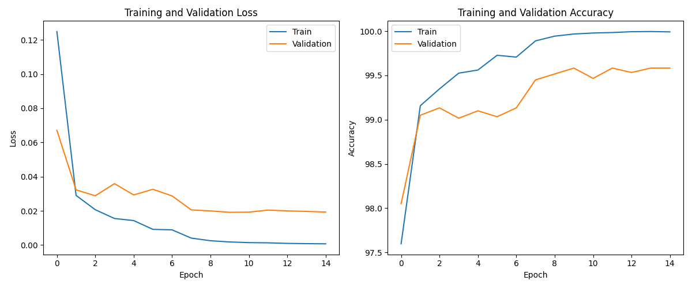
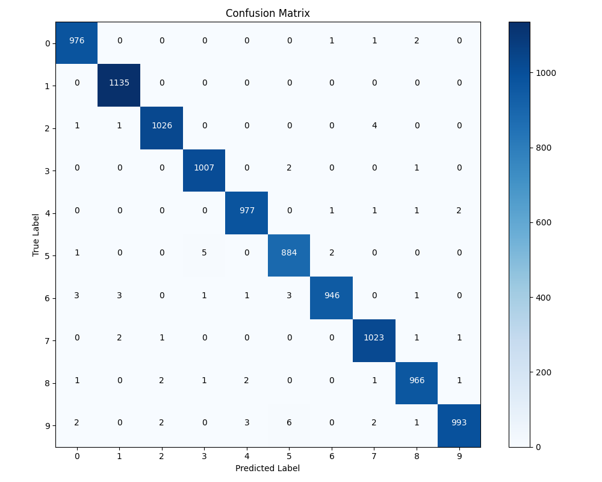
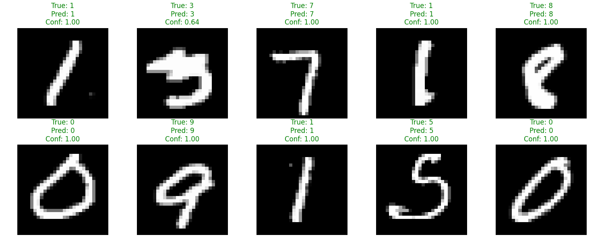
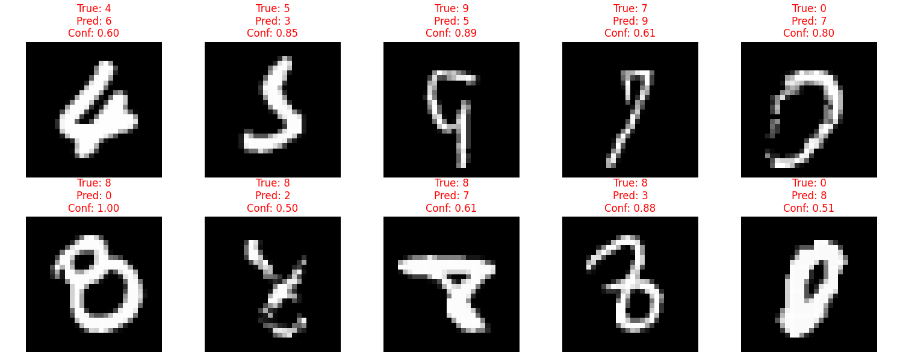

# MNIST Digit Classification with CNN 

This project implements two approaches for handwritten digit classification using Convolutional Neural Networks (CNNs) on the MNIST dataset:
1. A standard PyTorch CNN implementation
2. An improved CNN architecture with advanced training techniques

## Video Walkthrough
For a detailed explanation of the code and implementation, check out this [video walkthrough](https://drive.google.com/file/d/1YaOzqjaTndZni8Ugl5mBh-C6nxhqjV3c/view?usp=share_link).

## Project Features

- **Two CNN implementations**:
  - Basic PyTorch CNN with ~95% accuracy
  - Improved architecture with ~98% accuracy
- **Advanced techniques** including batch normalization, dropout, and data augmentation
- **Complete training pipeline** with learning rate scheduling and early stopping
- **Comprehensive visualization suite** including confusion matrices and error analysis
- **Support for custom images** to test the trained models

## Enhanced Features in the Improved Model

### 1. Architectural Improvements
- **Deeper Network**: Three convolutional blocks instead of two
- **Batch Normalization**: After each convolutional layer to stabilize training
- **Dropout Regularization**: To prevent overfitting
- **Kaiming Initialization**: Better weight initialization for faster convergence

### 2. Training Optimizations
- **Data Augmentation**: Random affine transformations and erasing
- **Learning Rate Scheduling**: Adaptive learning rate based on validation performance
- **Early Stopping**: Prevents overfitting by monitoring validation metrics
- **Gradient Clipping**: Prevents gradient explosion
- **Train/Validation Split**: Better monitoring of generalization performance

## Results

### Performance Comparison
| Model | Test Accuracy | Parameters | Training Time |
|-------|---------------|------------|--------------|
| Basic CNN | ~95% | 122,570 | 15 minutes |
| Improved CNN | ~98% | 391,370 | 25 minutes |

### Visualizations

The improved model generates several visualizations to analyze performance:

#### Training Curves

#### Confusion Matrix

#### Sample Predictions

#### Misclassified Examples

 